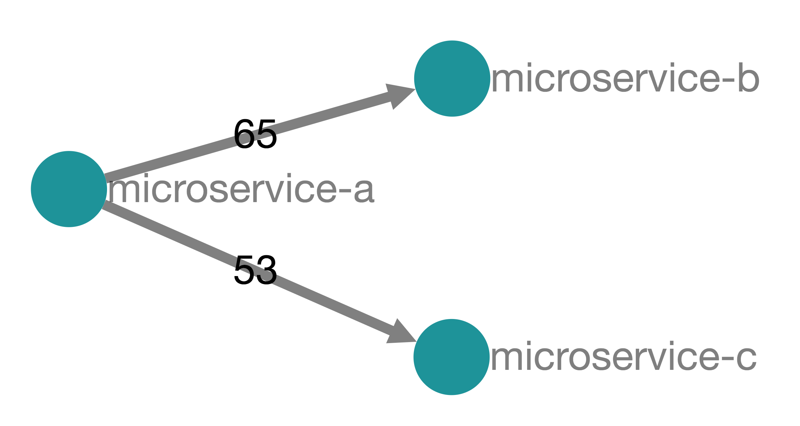
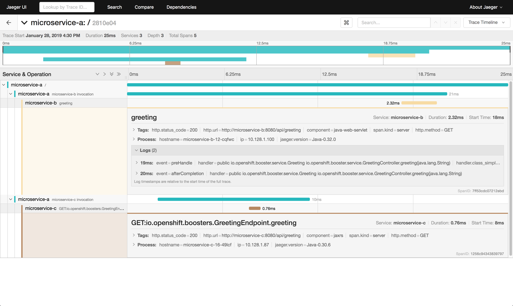
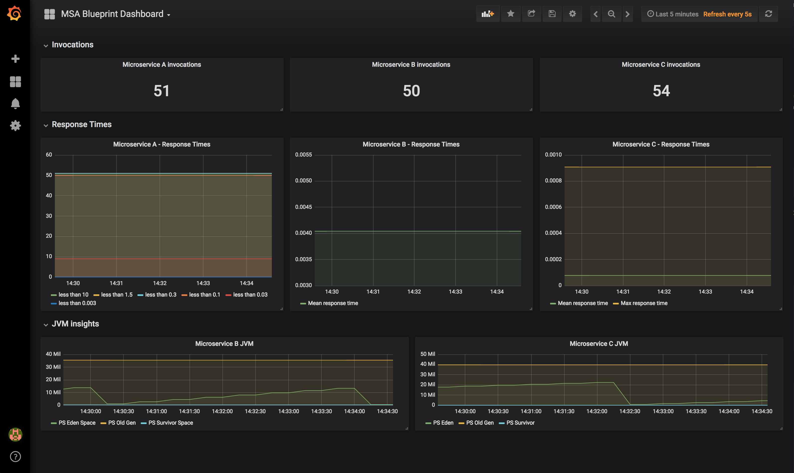

# openshift-msa-blueprint

Microservices architecture blueprint on OpenShift. This repository holds a simple microservices application written using Node.js, Spring Boot 2.x and Thorntail 2.x frameworks and runtime.

Its goals are to demonstrate some crucial concerns of containerized microservices architecture and how they may be implemented using modern frameworks and support libraries. Such concerns include:
* **Services Discovery**: How to retrieve an other service URL / IP / Hostname in order to invoke it?
* **Configuration Management**: How to manage application configuration with immutable container images? How to use Kubernetes container-native concepts?
* **Resilience and Fault Tolerance**: How to inform outer world of the application health? How to integrate probes with Kubernetes orchestrator?
* **Distributed Tracing**: How to trace services and APIs calls in a highly distributed environment? How to analyse stuffs?
* **Centralized Metrics**: How your application may expose custom metrics and make them consumable by a central service? How to monitor and alert?

## What's in this repository?

This repository holds a simple application made of 3 microservices: `microservice-a`, `microservice-b` and `microservice-c`. Each microservice is a simple *greeter service* that says hello in different languages.

`microservice-a` acts as an aggregator: it says "hello" but also invokes the `microservice-b` and `microservice-c` components in parallel to gather their responses.



When you invoke the `/api/greeting` endpoint of `microservice-a` (with optional query parameter `name`), you may receive something like that:

```json
{
  "a":{
    "content":"Hello World from a ConfigMap!"
  },
  "b":{
    "content":"Bonjour World from a ConfigMap!"
  },
  "c":{
    "content":"Hola World from a ConfigMap!"
  }
}
```

You'll get results within keys `b` and `c` only if microservices are available.

So you'll learn how to deploy this services on OpenShift using externalized configuration and declaring health probes that will allow OpenShift to know the health status of your microservices and take actions.

Moreover, we'll deploy this application and make them elligible for using OpenTracing standards. You'll be able to observe the microservices orchestrations and get trace details like the screenshot below:



We'll also deploy this application with custom metrics supports so that each microservice will be able to publish custom metrics for its endpoints and give insights on its internal behavior. Metrics will be collected by [Prometheus](https://prometheus.io) and we provide a custom [Grafana](http://grafana.io) dashboard for visaulizing those metrics.



## Supporting Tools installation

To get the full features activated, we recommend installing Prometheus, Grafana and Jaeger onto your OpenShift environment. By default, I like to install everything into a separate `cockpit` OpenShift project that I make global in order to allow microservices components to push data to Jaeger.

Here's the commands I'm using:

```
$ oc new-project cockpit --display-name="Cockpit"
$ oc adm pod-network make-projects-global cockpit
```

If you're using something like Minishift or the CDK (Container Development Kit), you may want to have a look at https://github.com/nmasse-itix/OpenShift-Docker-Images/tree/master/grafana for installing simple, stripped down version of Grafana and Prometheus.

If you're using a full blown OpenShift cluster, I recommend installing both tools the standard way, reusing the provided Ansible playbooks (provided into
`/usr/share/ansible/openshift-ansible/playbooks/openshift_prometheus` and
`/usr/share/ansible/openshift-ansible/playbooks/openshift_grafana`).

Jaeger can be simply installed using the following command:

```
$ oc process -f https://raw.githubusercontent.com/jaegertracing/jaeger-openshift/master/all-in-one/jaeger-all-in-one-template.yml | oc create -f -
```

## Get Started

* Deploy Microservice A using this [instructions](./microservice-a/README.md).
* Deploy Microservice B using this [instructions](./microservice-b/README.md).
* Deploy Microservice C using this [instructions](./microservice-c/README.md).
